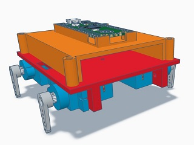

# pico4legsBot

Raspberry Pi Pico running on four servo has legs

servo.py    - RC servo class. Allow to use angle instead of time.  
botlegs.py  - Robot legs class to move the legs. Create 4 servos and timer for movement  
bot.py      - Main python script with UDP socket and wifi. From joystick hats (x,y) to bot 

stick.py    - Raspberry Pi python script to read joystick and send UDP socket

The STL folder contains the 3Dprint parts code.

-Links 
<a href="https://www.tinkercad.com/things/6ZhC9Yglp2E-pico-rc-servo-on-leg"> Tinkercad Design</a> 
<a href="https://youtu.be/nC8gTRUxHxI">Youtube video</a> 
<a href="https://youtu.be/K8TxNaSnl-0">Youtube video with gamepad USB dongle directly to pico</a>

