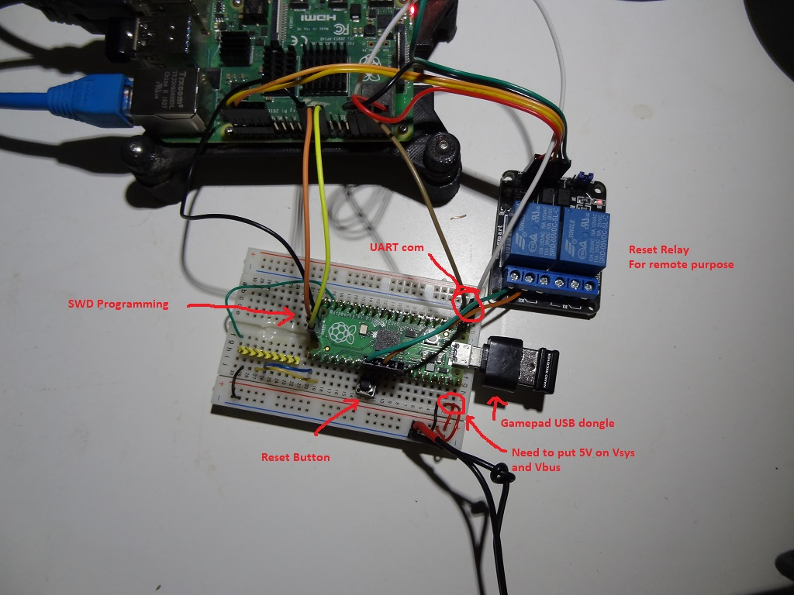

PRELIMINARY 

** update with new Micropython version

Currently I'm not able to get the gamepad working in host mode.
I will check why later.

In the mean time I put on dropbox a previous micropython version which works.

DropBox link : <a href="https://www.dropbox.com/s/s2t0u0pw5ugmwni/pico4legsBot_micropython.tgz?dl=1"> pico 4 legs bot micropython source code</a>

untar the compress file into a folder and,
<blockquote>
cd micropython 
make -C ports/rp2 BOARD=PICO_W submodules 
make -C mpy-cross 
cd ports/rp2 
make BOARD=PICO_W 
</blockquote>

The firmware.elf or firmware.uf2 will be create in build-PICO_W folder

N.B. For Pico just use PICO instead of PICO_W in the make.

<s>

1 - Add gamepad.c and hid_app.c in ports/rp2   

*** please do not copy over the CMakeLists.txt in my github. Just modify your current CMakeLists.txt 
2 - In CMakeLists.txt I added. gamepad.c  and hid_app.c in set(MICROPY_SOURCE_PORT 
3 - In CMakeLists.txt I added ${PROJECT_SOURCE_DIR}/gamepad.c  in set(MICROPY_SOURCE_QSTR  
4 - In CMakeLists.txt I added tinyusb_host in set(PICO_SDK_COMPONENTS  
5 -  In mpconfigport.h I change MICROPY_HW_ENABLE_USBDEV to (0) and (1) for UART 
6 -  In mpconfigport.h add poll_gamepad() 

	#define MICROPY_EVENT_POLL_HOOK_FAST \
	do { \
	if (get_core_num() == 0) { MICROPY_HW_USBDEV_TASK_HOOK } \
	extern void mp_handle_pending(bool); \
	mp_handle_pending(true); \
	extern void poll_gamepad();\
	poll_gamepad();\
	} while (0)

7 -  I rename shared/tinyusb/tusbconfig.h  to  tusbconfig.original.h 

8 -  I copy tusbconfig.h from my github to shared/tinyusb 

9 - recompile 
</s>
10 - To get the game pad working

	import gamepad as gp
	gp.hat() -> will return (x,y) coordonate of the hat
	gp.get() -> will return the 10 bytes record of the gamepad. X,Y,Z,Rx,Ry,Hat, buttons. 32 bits for buttons
 
N.B. You need to provide 5V on Vsys and Vusb since no power will be delivered from usb port. 
communication will be from uart GP0 and GP1.

Some gamepads don't have the same layout! Check what the gamepad.get() to see what is what.

Work to do, 

- <s>Find a better way to poll the usb</s> Done! 
- Use page usage. I think that the gamepad record is 5. I should check for page usage 5 . 
- <s>Set default hat to >8. This will tell the gamepad is not connected yet.</s> Done! 
- <s>remove added stuff from main.c  No need to change main.c.</s> Done!

Bug in Thonny!  Be aware that Thonny only see /dev/ttyAMA0. You need to flip /dev/ttyS0 to /dev/ttyAMA0.  I used "su mv" when I boot my Pi.
